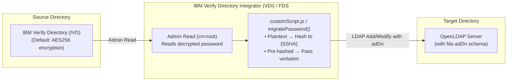

# Synchronizing IBM Verify Directory to OpenLDAP with FDS (with Password Retention)

> **Sample / Example Guide:** This guide and associated files are provided as an example showing how to configure IBM Verify Directory Integrator (VDI) Federated Directory Server (FDS) to synchronize identities into an OpenLDAP target while retaining user authentication passwords.

---

## Overview

This example demonstrates how to migrate and synchronize identity entries (users, groups, containers) from **IBM Verify Directory (IVD)** (or other supported LDAP sources) into **OpenLDAP** using **IBM Verify Directory Integrator (VDI) Federated Directory Server (FDS)**.

FDS's stock writer already knows how to write persons, groups, and containers to any standard LDAP server when the target is configured as *generic LDAP* (`target.isLDAP=true`, `target.isTDS=false`).

> **The Key Configuration Setting:**
> Two custom properties on the flow under **Source → Advanced Settings → Custom properties** (one per line):
> ```properties
> target.isTDS=false
> target.isLDAP=true
> ```
> Without these properties, FDS assumes the target is an IBM Directory Server (IVD/ISVD) and attempts to write proprietary schema and metadata.



---

## Reference Documentation

* [IBM Documentation: Federated Directory Server (v11.0.0)](https://www.ibm.com/docs/en/vdi/11.0.0?topic=server-federated-directory)
* [IBM VDI Federated Directory Server Guide (PDF)](https://www.ibm.com/docs/en/SSVDLE_11.0.0/pdf/ibm_svdi_fds_guide.pdf)

---

## Contents of this Sample

```
schema/
  ├── fds-adDn.ldif             # OpenLDAP: adDn attribute + fdsSyncMetadata objectClass (load 1st)
  ├── fds-linked-entry.ldif     # OpenLDAP: activedirectorylinkedentry + ibm-ptaReferral (load 2nd)
  └── fds-adDn-index.ldif       # OpenLDAP: adDn equality index (ldapmodify, load 3rd)
maps/
  ├── customScript-additions.js # JavaScript password helper functions to append to customScript.js
  └── person.map.patch          # Single-line person.map change for userPassword retention
docker/                         # Optional throwaway OpenLDAP docker environment for testing
test/                           # Maintainer checks for this example only. Not part of the FDS setup; ignore when implementing.
```

---

## Verified Capabilities & Scope

Tested against FDS on IBM Verify Directory Integrator (VDI) **11.0.0.2**, an IBM Verify Directory (IVD) source, and OpenLDAP (`mdb` backend).

* **Initial Synchronization**: Users, containers, and groups synchronized end to end through the generic-LDAP target, including container creation and member DN translation via `adDn`.
* **Incremental Synchronization**: Attribute modifications (e.g., changing `telephoneNumber`), additions, and member updates propagate cleanly to OpenLDAP.
* **Password Retention (Reversible IVD Passwords)**: Validated against IVD default `ibm-slapdPwEncryption=AES256`. An admin read (`cn=root`) retrieves the cleartext value, which the helper hashes into a salted `{SSHA}` with an 8-byte salt before writing to OpenLDAP. Migrated users authenticate successfully via `ldapwhoami`.
* **Group Mapping**: Translation of group classes during synchronization (e.g., `groupOfUniqueNames` with `uniqueMember` &rarr; `groupOfNames` with `member`) with member DNs mapped to the target subtree.

---

## 1. Prerequisites

- A running **IBM Verify Directory Integrator (VDI)** instance with FDS configured and a working source endpoint that reads correctly.
- An **OpenLDAP** server with standard `core`, `cosine`, and `inetorgperson` schemas loaded (default across standard distributions). These support `inetOrgPerson`, `organizationalUnit`, `organization`, `domain`, `groupOfNames`, and `groupOfUniqueNames`.
- Administrative bind credentials on OpenLDAP with write access to `cn=config` (for schema additions) and the target data subtree.

### 1.1 Load Schema Additions into OpenLDAP

FDS stamps target entries with tracking metadata (`adDn`) and auxiliary link classes. Load these schema additions into OpenLDAP in the following order:

| File | Why it is needed | Example OID Arc |
|---|---|---|
| `schema/fds-adDn.ldif` | FDS stamps each target entry with `adDn` (the entry's source DN) and resolves group members in the target by matching `adDn`. Also used for incremental moves/renames. | RFC 4512 / RFC 5612 sample arc (`1.3.6.1.4.1.805361.1.1`, `.4`) |
| `schema/fds-linked-entry.ldif` | Stock FDS adds the auxiliary class `activedirectorylinkedentry` (`adDn` + `adObjectGUIDStr`) to entries and `ibm-ptaReferral` (`ibm-ptaLinkAttribute`/`ibm-ptaLinkValue`) to persons. OpenLDAP rejects writes without these definitions (`objectClass invalid per syntax` / `attribute type undefined`). | RFC 4512 / RFC 5612 sample arc (`1.3.6.1.4.1.805361.1.3`, `.5`) |
| `schema/fds-adDn-index.ldif` | Every group member resolution performs an equality search on `(adDn=...)`. Without an index, slapd scans the entire database per member, leading to high latency on large directories. | N/A |

> **Note on Schema OIDs:** The sample LDIF schema files use documentation example OIDs under the `1.3.6.1.4.1.805361.1.x` arc (per RFC 4512 / RFC 5612). For production deployments, substitute these with your organization's registered Private Enterprise Number (PEN) OID arc.

#### Applying Schema (Local OpenLDAP):
```bash
ldapadd    -Y EXTERNAL -H ldapi:/// -f schema/fds-adDn.ldif
ldapadd    -Y EXTERNAL -H ldapi:/// -f schema/fds-linked-entry.ldif
ldapmodify -Y EXTERNAL -H ldapi:/// -f schema/fds-adDn-index.ldif
```

#### Applying Schema (Containerized OpenLDAP):
```bash
CID=<container-name-or-id>
for f in fds-adDn fds-linked-entry fds-adDn-index; do docker cp schema/$f.ldif "$CID":/tmp/; done
docker exec "$CID" ldapadd    -Y EXTERNAL -H ldapi:/// -f /tmp/fds-adDn.ldif
docker exec "$CID" ldapadd    -Y EXTERNAL -H ldapi:/// -f /tmp/fds-linked-entry.ldif
docker exec "$CID" ldapmodify -Y EXTERNAL -H ldapi:/// -f /tmp/fds-adDn-index.ldif
```

> **Index Target:** `schema/fds-adDn-index.ldif` targets `olcDatabase={1}mdb,cn=config`. Confirm your database DN using:
> `ldapsearch -Y EXTERNAL -H ldapi:/// -b cn=config "(olcSuffix=dc=example,dc=com)" dn`
> If data already exists before applying the index, run `slapindex -b "dc=example,dc=com" adDn` while slapd is stopped.

---

## 2. Configuring FDS

### 2.1 Initialize FDS Default Solution Files
Open the FDS UI once (`https://<vdi-host>:<port>/fds`). On first access, FDS populates the solution directory: it creates `sdi_solution_dir/LDAPSync/` (stock mapping files and `customScript.js`) and places `LDAPSync.xml` and `SE_DefaultFDS.xml` in `sdi_solution_dir/configs/`.

> **Important:** Never overwrite stock mapping files or `customScript.js` completely. Only append additions or make targeted line changes as described below.

### 2.2 Configure Password Retention
Stock FDS replaces the source password with a random string (`userPassword=generatePassword(null)`) under the assumption that pass-through authentication (PTA) will handle verification. For OpenLDAP targets, credentials must be retained and migrated:

In `sdi_solution_dir/LDAPSync`:

1. **Append JavaScript Helpers**: Append the contents of `maps/customScript-additions.js` to the end of `customScript.js`. This provides `migratePassword()` and its internal helper functions (`pwValueToString`, `pwScheme`, `hashSSHA`, `sshaEncode`, `_b64manual`). If you already appended a copy previously, remove it first to avoid duplicate definitions.
2. **Update User Password Mapping**: In `person.map`, change the single line:
   ```properties
   # Change:
   userPassword=generatePassword(null)
   # To:
   userPassword=migratePassword(work)
   ```
3. Restart VDI so the modified script and map files are reloaded.

### 2.3 Target Connection Settings
In the FDS UI, navigate to **Directory Server** (left panel) &rarr; **Connection Settings**:

| Field | Value |
|---|---|
| **LDAP URL** / Host name / Port / **Use SSL** | Target OpenLDAP host, port (389 or 636), tick **Use SSL** for LDAPS |
| **User Login / Password** | OpenLDAP administrative bind DN and password |
| **Default Target Container** | OpenLDAP base DN (e.g., `dc=example,dc=com`) |

Click **Test Connection** to verify connectivity. Leave **Write-back** and **Pass-through Authentication** unconfigured (they are specific to IBM Directory Server targets).

### 2.4 Flow Settings
Create or edit your flow under the **Flows** tab:

1. **Switch FDS to Generic LDAP Mode:**
   Go to **Source → Advanced Settings → Custom properties** and add (one per line):
   ```properties
   target.isTDS=false
   target.isLDAP=true
   ```
   *Note: Custom properties take precedence over UI fields and reliably override target behavior.*

2. **General Settings:**
   - Enable **Handle Person entries** and **Handle Group entries**.
   - If writing into fixed containers rather than mirroring source OU structure, leave **Mirror the source hierarchy into Directory Server** unchecked.
   - Set **Target container for Users** (`target.suffixForUsers`, e.g., `ou=People,dc=example,dc=com`).
   - Set **Target container for Groups** (`target.suffixForGroups`, e.g., `ou=Groups,dc=example,dc=com`).
   - FDS automatically creates target containers if they do not exist.

3. **User and Group Class Settings:**
   Configure target object classes and attribute mappings:

   | Property | Description | Example |
   |---|---|---|
   | `target.userObjectClass` | Object class(es) for persons | `inetOrgPerson` |
   | `target.userRDN` | RDN attribute for person DNs | `cn` (produces `cn=Alice Johnson,ou=People,...`) |
   | `target.groupObjectClass` | Object class(es) for groups | `groupOfNames` (or `groupOfUniqueNames`) |
   | `target.groupMemberAttribute` | Membership attribute name | `member` (or `uniqueMember`) |

   > **Pair Group Class and Member Attribute:** Always pair `groupOfNames` with `member`, or `groupOfUniqueNames` with `uniqueMember`. Converting between them during synchronization is fully supported, but both properties must be updated together to avoid LDAP error 65 schema violations.

### 2.5 Extra Attributes and Auxiliary Classes
- **Additional Attributes:** To synchronize attributes beyond standard `inetOrgPerson`, add them via the FDS Mapping editor or directly into `person.map` (e.g., `title=`, `employeeNumber=`), ensuring corresponding attributes exist in OpenLDAP schema.
- **Auxiliary Classes:** `target.userObjectClass` and `target.groupObjectClass` accept comma-separated lists (e.g., `inetOrgPerson,customAuxClass`). Do not include spaces around commas.

---

## 3. Password Handling & Migration Details

`migratePassword()` evaluates incoming source credentials and determines the appropriate migration action:

1. **Pre-hashed Passwords**: If a password string begins with a scheme recognized by OpenLDAP (`{SSHA}`, `{SHA}`, `{SMD5}`, `{MD5}`, `{CRYPT}`, SHA-2 family, `{PBKDF2...}`, `{ARGON2}`), it is written **verbatim** without re-hashing to prevent double-hashing login failures.
2. **Plaintext / Reversible Credentials**: IVD defaults to `ibm-slapdPwEncryption=AES256` (reversible). When FDS binds as `cn=root`, IVD decrypts the password on read and returns cleartext. `migratePassword()` intercepts the cleartext and hashes it to salted `{SSHA}` using `java.security.MessageDigest` and `SecureRandom` before writing to OpenLDAP.
3. **Un-decrypted AES Values**: If an encrypted `{AES128}`/`{AES192}`/`{AES256}` string is received (indicating the bind user lacked decrypt privileges), FDS skips writing the password and logs a warning, preventing unresolvable encrypted blobs in OpenLDAP.

### Validating Source Password Schemes Prior to Migration

1. **Survey existing hash schemes in IVD** (run as an administrative bind):
   ```bash
   ldapsearch -x -LLL -o ldif-wrap=no -H ldap://<source-host> -D <admin-dn> -W \
     -b <base-dn> "(userPassword=*)" userPassword | python3 -c '
   import sys,base64,re,collections
   c=collections.Counter()
   for l in sys.stdin:
       if l.startswith("userPassword"):
           v=l.split(":",1)[1]
           v=base64.b64decode(v[1:]).decode("utf-8","replace") if v.startswith(":") else v.strip()
           m=re.match(r"\{([^}]+)\}",v); c[m.group(1).upper() if m else "CLEARTEXT"]+=1
   for k,n in c.most_common(): print(n,k)'
   ```
   *(Entries showing `CLEARTEXT` correspond to AES-encrypted reversible passwords returned decrypted to admin).*

2. **Test individual password schemes against OpenLDAP:**
   ```bash
   ldapadd -x -H ldap://<openldap-host> -D <admin-dn> -W <<'LDIF'
   dn: uid=schemetest,ou=People,dc=example,dc=com
   objectClass: inetOrgPerson
   uid: schemetest
   cn: schemetest
   sn: schemetest
   userPassword: <stored-scheme-value>
   LDIF

   ldapwhoami -x -H ldap://<openldap-host> -D "uid=schemetest,ou=People,dc=example,dc=com" -w '<password>'
   ```

3. **Verify Stored Passwords in OpenLDAP:**

   | Stored Pattern in OpenLDAP | Interpretation |
   |---|---|
   | `{SSHA}` followed by ~40 base64 chars | Successfully hashed by `migratePassword()` from plaintext source. |
   | `{SSHA}...` identical to source | Pre-hashed source password passed through verbatim. |
   | No `userPassword` present | Source provided un-decrypted AES value or empty attribute; check flow logs. |
   | `{AES256}...` or readable text | Misconfiguration; check that `customScript.js` and `person.map` are properly updated. |

---

## 4. Security Considerations

- **Enable LDAPS/TLS on All Connections:** Ensure both source (IVD) and target (OpenLDAP) connections use TLS/LDAPS. Passwords decrypted in transit between IVD, VDI, and OpenLDAP must remain encrypted over the wire.
- **Log Sanitation & Access:** If an LDAP Add or Modify operation encounters an error, FDS writes the work entry dump to `LDAPSync/logs/Flow_<name>_LDAPMigrate.log`. Restrict file permissions on the `LDAPSync/logs` directory and rotate log files regularly. Ensure `global.debug` is disabled in production.
- **Privileged Bind Security:** The administrative credentials (`cn=root`) required to read decrypted passwords from IVD must be protected, scoped strictly to migration tasks, and rotated upon completion where appropriate.

---

## 5. End-to-End Verification Procedure

### 5.1 Initial Synchronization
1. In the FDS UI, start **Initial Synchronization**.
2. Query OpenLDAP to confirm entries were created with `adDn` metadata:
   ```bash
   # Check Users
   ldapsearch -x -H ldap://localhost:389 -D "cn=admin,dc=example,dc=com" -w adminpw \
     -b "dc=example,dc=com" "(objectClass=inetOrgPerson)" dn adDn

   # Check Groups & Membership Translation
   ldapsearch -x -H ldap://localhost:389 -D "cn=admin,dc=example,dc=com" -w adminpw \
     -b "dc=example,dc=com" "(|(objectClass=groupOfNames)(objectClass=groupOfUniqueNames))" \
     dn member uniqueMember
   ```
3. Test authentication for a migrated user:
   ```bash
   ldapwhoami -x -H ldap://localhost:389 \
     -D "cn=Alice Johnson,ou=People,dc=example,dc=com" -w 'SecretPassword123'
   ```

### 5.2 Incremental Synchronization
1. Update an attribute (e.g., `telephoneNumber`) on a user in IVD.
2. In FDS, trigger **Incremental Synchronization**.
3. Verify that the updated attribute value is reflected in OpenLDAP.
4. Verify user authentication remains functional after attribute modification.

---

## 6. Troubleshooting

| Issue / Error | Cause | Resolution |
|---|---|---|
| `LDAP error code 21 ... objectClass: value #1 invalid per syntax` on group, or `error code 17 ... ibm-ptaLinkValue: attribute type undefined` on person | OpenLDAP target is missing auxiliary link or PTA schema definitions. | Load `schema/fds-linked-entry.ldif` (after `schema/fds-adDn.ldif`) into OpenLDAP `cn=config`. |
| `LDAP error code 65 - object class 'groupOfNames' requires attribute 'member'` | Group object class and member attribute configuration disagree (e.g., `groupOfNames` configured with `uniqueMember`). | Ensure `target.groupObjectClass=groupOfNames` and `target.groupMemberAttribute=member` (or `groupOfUniqueNames` and `uniqueMember`) are set consistently in flow properties. |
| `CTGDII572I Skipping member because no entry was found in the target` | Member DN translation failed because the referenced person entry was not found in OpenLDAP by `adDn`. | Ensure person entries are synchronized before groups. Resolve any errors affecting person entries first. |
| `CTGDIS183E Error while mapping attribute 'userPassword'` | Exception occurred inside `migratePassword()` script execution. | Check `customScript.js` to ensure additions were appended cleanly without duplicate function declarations, and restart VDI. |
| Missing stock functions (`groupObjectClass` / `userObjectClass` not found) | Stock `customScript.js` or map files were overwritten instead of appended. | Restore pristine copies of stock map files and `customScript.js` from `sdi_install_dir/LDAPSync/`, then re-apply section 2.2 edits. |
| `objectClass/attribute undefined` on entry write | Custom attribute or class is not defined in OpenLDAP schema. | Add missing attribute/class definitions to OpenLDAP schema before synchronizing. |
| Password authentication fails for SHA-2 hashes (`{SSHA256}` / `{SSHA512}`) | OpenLDAP lacks SHA-2 password hashing module support. | Load OpenLDAP's `pw-sha2` contrib module into `cn=config`. |

---

## 7. Known Constraints & Notes

- **Generic-LDAP Target Limitations:** Pass-through authentication (PTA) and SDS-specific write-back are proprietary to IBM Directory Server targets and are not available when targeting generic OpenLDAP.
- **Index Requirement:** The `adDn` equality index in OpenLDAP is strongly recommended to maintain performance during group member translation searches.
- **Source Changelog Dependency:** If the source endpoint lacks a changelog and an entry's DN changes after the initial sync, `moddn`/`modrdn` operations may not automatically propagate on incremental runs without a changelog connector.
